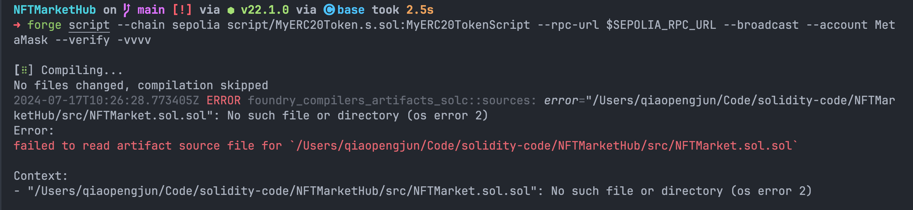
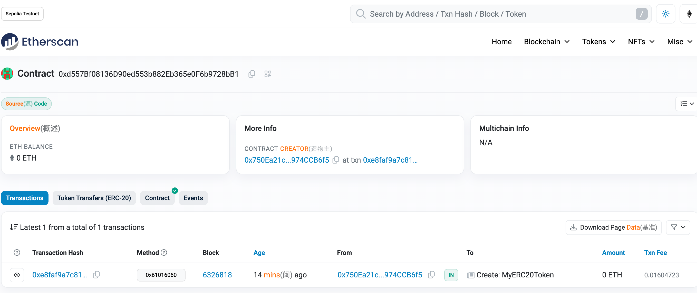
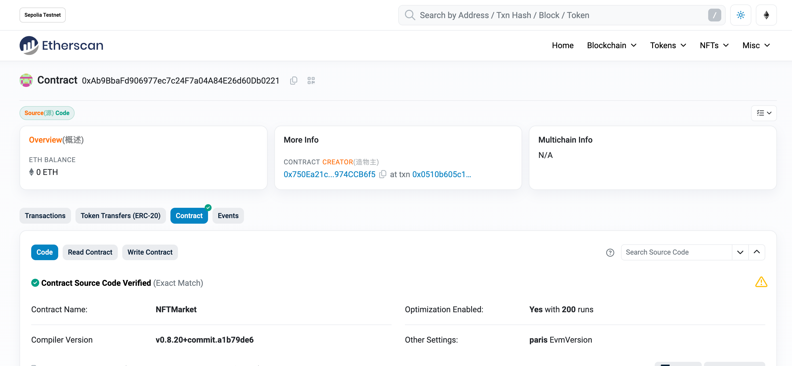

# 实战：NFTMarketHub


## 部署脚本

```solidity
// SPDX-License-Identifier: UNLICENSED
pragma solidity ^0.8.13;

import {Script, console} from "forge-std/Script.sol";
import {MyERC20Token} from "../src/MyERC20Token.sol";

contract MyERC20TokenScript is Script {
    MyERC20Token public mytoken;

    function setUp() public {}

    function run() public {
        vm.startBroadcast();

        mytoken = new MyERC20Token(msg.sender);
        console.log("MyERC20Token deployed to:", address(mytoken));

        vm.stopBroadcast();
    }
}

```


## 部署合约

#### 报错解决



解决：`forge clean   `


#### 部署成功

```shell
NFTMarketHub on  main [!] via ⬢ v22.1.0 via 🅒 base took 4.2s 
➜ source .env

NFTMarketHub on  main [!] via ⬢ v22.1.0 via 🅒 base 
➜ forge script --chain sepolia script/MyERC20Token.s.sol:MyERC20TokenScript --rpc-url $SEPOLIA_RPC_URL --broadcast --account MetaMask --verify -vvvv

[⠊] Compiling...
No files changed, compilation skipped
Enter keystore password:
Traces:
  [1927821] MyERC20TokenScript::run()
    ├─ [0] VM::startBroadcast()
    │   └─ ← [Return] 
    ├─ [1881633] → new MyERC20Token@0xd557Bf08136D90ed553b882Eb365e0F6b9728bB1
    │   ├─ emit OwnershipTransferred(previousOwner: 0x0000000000000000000000000000000000000000, newOwner: DefaultSender: [0x1804c8AB1F12E6bbf3894d4083f33e07309d1f38])
    │   └─ ← [Return] 9047 bytes of code
    ├─ [0] console::log("MyERC20Token deployed to:", MyERC20Token: [0xd557Bf08136D90ed553b882Eb365e0F6b9728bB1]) [staticcall]
    │   └─ ← [Stop] 
    ├─ [0] VM::stopBroadcast()
    │   └─ ← [Return] 
    └─ ← [Stop] 


Script ran successfully.

== Logs ==
  MyERC20Token deployed to: 0xd557Bf08136D90ed553b882Eb365e0F6b9728bB1

## Setting up 1 EVM.
==========================
Simulated On-chain Traces:

  [1881633] → new MyERC20Token@0xd557Bf08136D90ed553b882Eb365e0F6b9728bB1
    ├─ emit OwnershipTransferred(previousOwner: 0x0000000000000000000000000000000000000000, newOwner: DefaultSender: [0x1804c8AB1F12E6bbf3894d4083f33e07309d1f38])
    └─ ← [Return] 9047 bytes of code


==========================

Chain 11155111

Estimated gas price: 15.090597416 gwei

Estimated total gas used for script: 2722903

Estimated amount required: 0.041090232975818648 ETH

==========================

##### sepolia
✅  [Success]Hash: 0xe8faf9a7c819bd8d4a2f5ca01030d3c420df711731703988b33011b327c2f8f5
Contract Address: 0xd557Bf08136D90ed553b882Eb365e0F6b9728bB1
Block: 6326818
Paid: 0.016047232328922354 ETH (2095191 gas * 7.659078494 gwei)

✅ Sequence #1 on sepolia | Total Paid: 0.016047232328922354 ETH (2095191 gas * avg 7.659078494 gwei)
                                                                                                                                

==========================

ONCHAIN EXECUTION COMPLETE & SUCCESSFUL.
##
Start verification for (1) contracts
Start verifying contract `0xd557Bf08136D90ed553b882Eb365e0F6b9728bB1` deployed on sepolia

Submitting verification for [src/MyERC20Token.sol:MyERC20Token] 0xd557Bf08136D90ed553b882Eb365e0F6b9728bB1.

Submitting verification for [src/MyERC20Token.sol:MyERC20Token] 0xd557Bf08136D90ed553b882Eb365e0F6b9728bB1.

Submitting verification for [src/MyERC20Token.sol:MyERC20Token] 0xd557Bf08136D90ed553b882Eb365e0F6b9728bB1.

Submitting verification for [src/MyERC20Token.sol:MyERC20Token] 0xd557Bf08136D90ed553b882Eb365e0F6b9728bB1.

Submitting verification for [src/MyERC20Token.sol:MyERC20Token] 0xd557Bf08136D90ed553b882Eb365e0F6b9728bB1.
Submitted contract for verification:
        Response: `OK`
        GUID: `cwwzeekad22aijh7sqhtlifbz11icmwignhtdf9dcbmdtfczrb`
        URL: https://sepolia.etherscan.io/address/0xd557bf08136d90ed553b882eb365e0f6b9728bb1
Contract verification status:
Response: `NOTOK`
Details: `Pending in queue`
Contract verification status:
Response: `OK`
Details: `Pass - Verified`
Contract successfully verified
All (1) contracts were verified!

Transactions saved to: /Users/qiaopengjun/Code/solidity-code/NFTMarketHub/broadcast/MyERC20Token.s.sol/11155111/run-latest.json

Sensitive values saved to: /Users/qiaopengjun/Code/solidity-code/NFTMarketHub/cache/MyERC20Token.s.sol/11155111/run-latest.json


```

https://sepolia.etherscan.io/address/0xd557bf08136d90ed553b882eb365e0f6b9728bb1




## MyERC721Token


部署脚本

```solidity
// SPDX-License-Identifier: UNLICENSED
pragma solidity ^0.8.13;

import {Script, console} from "forge-std/Script.sol";
import {MyERC721Token} from "../src/MyERC721Token.sol";

contract MyERC721TokenScript is Script {
    MyERC721Token public my721token;

    function setUp() public {}

    function run() public {
        vm.startBroadcast();

        my721token = new MyERC721Token(msg.sender);
        console.log("MyERC721Token deployed to:", address(my721token));

        vm.stopBroadcast();
    }
}

```

### 部署

```shell
NFTMarketHub on  main [!?] via ⬢ v22.1.0 via 🅒 base took 1m 18.6s 
➜ source .env

NFTMarketHub on  main [!?] via ⬢ v22.1.0 via 🅒 base 
➜ forge script --chain sepolia script/MyERC721Token.s.sol:MyERC721TokenScript --rpc-url $SEPOLIA_RPC_URL --broadcast --account MetaMask --verify -vvvv

[⠊] Compiling...
[⠔] Compiling 1 files with Solc 0.8.20
[⠒] Solc 0.8.20 finished in 1.44s
Compiler run successful!
Enter keystore password:
Traces:
  [2119248] MyERC721TokenScript::run()
    ├─ [0] VM::startBroadcast()
    │   └─ ← [Return] 
    ├─ [2072840] → new MyERC721Token@0xC39B0eE94143C457449e16829837FD59d722933C
    │   ├─ emit OwnershipTransferred(previousOwner: 0x0000000000000000000000000000000000000000, newOwner: DefaultSender: [0x1804c8AB1F12E6bbf3894d4083f33e07309d1f38])
    │   └─ ← [Return] 10002 bytes of code
    ├─ [0] console::log("MyERC721Token deployed to:", MyERC721Token: [0xC39B0eE94143C457449e16829837FD59d722933C]) [staticcall]
    │   └─ ← [Stop] 
    ├─ [0] VM::stopBroadcast()
    │   └─ ← [Return] 
    └─ ← [Stop] 


Script ran successfully.

== Logs ==
  MyERC721Token deployed to: 0xC39B0eE94143C457449e16829837FD59d722933C

## Setting up 1 EVM.
==========================
Simulated On-chain Traces:

  [2072840] → new MyERC721Token@0xC39B0eE94143C457449e16829837FD59d722933C
    ├─ emit OwnershipTransferred(previousOwner: 0x0000000000000000000000000000000000000000, newOwner: DefaultSender: [0x1804c8AB1F12E6bbf3894d4083f33e07309d1f38])
    └─ ← [Return] 10002 bytes of code


==========================

Chain 11155111

Estimated gas price: 10.85383427 gwei

Estimated total gas used for script: 2990587

Estimated amount required: 0.03245933566801649 ETH

==========================

##### sepolia
✅  [Success]Hash: 0x8e5b0e3a9df4e5231b88d28af9c0e6e903bf7afac027a2ee54bf5faaf67b40c0
Contract Address: 0xC39B0eE94143C457449e16829837FD59d722933C
Block: 6326900
Paid: 0.012441733790006772 ETH (2301162 gas * 5.406717906 gwei)

✅ Sequence #1 on sepolia | Total Paid: 0.012441733790006772 ETH (2301162 gas * avg 5.406717906 gwei)
                                                                                                                                

==========================

ONCHAIN EXECUTION COMPLETE & SUCCESSFUL.
##
Start verification for (1) contracts
Start verifying contract `0xC39B0eE94143C457449e16829837FD59d722933C` deployed on sepolia

Submitting verification for [src/MyERC721Token.sol:MyERC721Token] 0xC39B0eE94143C457449e16829837FD59d722933C.

Submitting verification for [src/MyERC721Token.sol:MyERC721Token] 0xC39B0eE94143C457449e16829837FD59d722933C.

Submitting verification for [src/MyERC721Token.sol:MyERC721Token] 0xC39B0eE94143C457449e16829837FD59d722933C.
Submitted contract for verification:
        Response: `OK`
        GUID: `q1v8v6kswcqvnzfdifksth4hdk1ss7ukejzxxfuktumivdrr5e`
        URL: https://sepolia.etherscan.io/address/0xc39b0ee94143c457449e16829837fd59d722933c
Contract verification status:
Response: `NOTOK`
Details: `Pending in queue`
Contract verification status:
Response: `OK`
Details: `Pass - Verified`
Contract successfully verified
All (1) contracts were verified!

Transactions saved to: /Users/qiaopengjun/Code/solidity-code/NFTMarketHub/broadcast/MyERC721Token.s.sol/11155111/run-latest.json

Sensitive values saved to: /Users/qiaopengjun/Code/solidity-code/NFTMarketHub/cache/MyERC721Token.s.sol/11155111/run-latest.json


```

https://sepolia.etherscan.io/address/0xc39b0ee94143c457449e16829837fd59d722933c


### NFTMarket


```solidity
// SPDX-License-Identifier: UNLICENSED
pragma solidity ^0.8.13;

import {Script, console} from "forge-std/Script.sol";
import {NFTMarket} from "../src/NFTMarket.sol";

contract NFTMarketScript is Script {
    NFTMarket public nftmarket;
    address public mytokenAddress;
    address public my721tokenAddress;

    function setUp() public {
        // 设置已部署的合约地址
        mytokenAddress = 0xd557Bf08136D90ed553b882Eb365e0F6b9728bB1;
        my721tokenAddress = 0xC39B0eE94143C457449e16829837FD59d722933C;
    }

    function run() public {
        vm.startBroadcast();

        // 部署 NFTMarket 合约，传入已部署的 mytoken 和 my721token 地址
        nftmarket = new NFTMarket(mytokenAddress, my721tokenAddress);
        // 使用 console.log 打印合约地址
        console.log("NFTMarket deployed to:", address(nftmarket));

        vm.stopBroadcast();
    }
}

```


```shell
NFTMarketHub on  main [!?] via ⬢ v22.1.0 via 🅒 base took 1m 20.1s 
➜ source .env                                                                                                                                           

NFTMarketHub on  main [!?] via ⬢ v22.1.0 via 🅒 base 
➜ forge script --chain sepolia script/NFTMarket.s.sol:NFTMarketScript --rpc-url $SEPOLIA_RPC_URL --broadcast --account MetaMask --verify -vvvv          

[⠊] Compiling...
[⠆] Compiling 1 files with Solc 0.8.20
[⠰] Solc 0.8.20 finished in 1.23s
Compiler run successful with warnings:
Warning (5667): Unused function parameter. Remove or comment out the variable name to silence this warning.
   --> src/NFTMarket.sol:112:9:
    |
112 |         address operator,
    |         ^^^^^^^^^^^^^^^^

Enter keystore password:
Traces:
  [1387543] NFTMarketScript::run()
    ├─ [0] VM::startBroadcast()
    │   └─ ← [Return] 
    ├─ [1337828] → new NFTMarket@0xAb9BbaFd906977ec7c24F7a04A84E26d60Db0221
    │   └─ ← [Return] 6459 bytes of code
    ├─ [0] console::log("NFTMarket deployed to:", NFTMarket: [0xAb9BbaFd906977ec7c24F7a04A84E26d60Db0221]) [staticcall]
    │   └─ ← [Stop] 
    ├─ [0] VM::stopBroadcast()
    │   └─ ← [Return] 
    └─ ← [Stop] 


Script ran successfully.

== Logs ==
  NFTMarket deployed to: 0xAb9BbaFd906977ec7c24F7a04A84E26d60Db0221

## Setting up 1 EVM.
==========================
Simulated On-chain Traces:

  [1337828] → new NFTMarket@0xAb9BbaFd906977ec7c24F7a04A84E26d60Db0221
    └─ ← [Return] 6459 bytes of code


==========================

Chain 11155111

Estimated gas price: 11.806426763 gwei

Estimated total gas used for script: 1947535

Estimated amount required: 0.022993429345879205 ETH

==========================

##### sepolia
✅  [Success]Hash: 0x0510b605c1b19eef0ec95a90ae12687e6bfbdd226c9d05d557727c7d6ad0b9b0
Contract Address: 0xAb9BbaFd906977ec7c24F7a04A84E26d60Db0221
Block: 6327016
Paid: 0.009214901996610328 ETH (1498534 gas * 6.149277892 gwei)

✅ Sequence #1 on sepolia | Total Paid: 0.009214901996610328 ETH (1498534 gas * avg 6.149277892 gwei)
                                                                                                                                                                  

==========================

ONCHAIN EXECUTION COMPLETE & SUCCESSFUL.
##
Start verification for (1) contracts
Start verifying contract `0xAb9BbaFd906977ec7c24F7a04A84E26d60Db0221` deployed on sepolia

Submitting verification for [src/NFTMarket.sol:NFTMarket] 0xAb9BbaFd906977ec7c24F7a04A84E26d60Db0221.

Submitting verification for [src/NFTMarket.sol:NFTMarket] 0xAb9BbaFd906977ec7c24F7a04A84E26d60Db0221.

Submitting verification for [src/NFTMarket.sol:NFTMarket] 0xAb9BbaFd906977ec7c24F7a04A84E26d60Db0221.
Submitted contract for verification:
        Response: `OK`
        GUID: `sv6lc6u9pnsdrdwb6wa9nci5nz5dfy69bvms5ncbzinkzjgqfb`
        URL: https://sepolia.etherscan.io/address/0xab9bbafd906977ec7c24f7a04a84e26d60db0221
Contract verification status:
Response: `NOTOK`
Details: `Pending in queue`
Contract verification status:
Response: `OK`
Details: `Pass - Verified`
Contract successfully verified
All (1) contracts were verified!

Transactions saved to: /Users/qiaopengjun/Code/solidity-code/NFTMarketHub/broadcast/NFTMarket.s.sol/11155111/run-latest.json

Sensitive values saved to: /Users/qiaopengjun/Code/solidity-code/NFTMarketHub/cache/NFTMarket.s.sol/11155111/run-latest.json


```





## 参考

- https://github.com/OpenZeppelin/openzeppelin-contracts/blob/master/contracts/interfaces/IERC2612.sol
- https://github.com/OpenZeppelin/openzeppelin-contracts/blob/master/contracts/mocks/EIP712Verifier.sol
- https://github.com/OpenZeppelin/openzeppelin-contracts/blob/master/contracts/utils/cryptography/EIP712.sol
- https://github.com/OpenZeppelin/openzeppelin-contracts/blob/master/contracts/token/ERC20/extensions/IERC20Permit.sol
- https://github.com/OpenZeppelin/openzeppelin-contracts/blob/master/contracts/token/ERC20/extensions/ERC20Permit.sol
- https://eips.ethereum.org/EIPS/eip-712
- https://eips.ethereum.org/EIPS/eip-2612
- https://www.openzeppelin.com/contracts
- https://github.com/AmazingAng/WTF-Solidity/blob/main/37_Signature/readme.md
- https://github.com/AmazingAng/WTF-Solidity/blob/main/52_EIP712/readme.md
- https://github.com/jesperkristensen58/ERC712-Permit-Example
- https://book.getfoundry.sh/tutorials/testing-eip712


